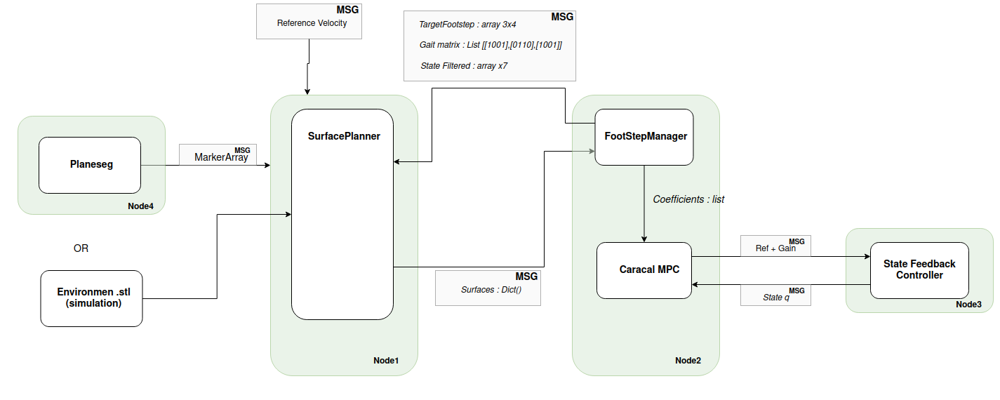

# memmo_anymal
Workspace containing the works related to the anymal demo for the Memmo project.

--> PlaneSeg and SL1M integration.

--> Caracal and SL1M integration.

The workspace is composed of 4 python modules:
- walkgen_foostep_planner
- walkgen_surface_planner
- walkgen_surface_processing
- walkgen_ros

---
## Installation
Install cmake submodule:
```
git submodule init
git submodule update
```

Build the walkgen library:
```
mkdir build
cd build
cmake .. -DCMAKE_BUILD_TYPE=RELEASE -DCMAKE_INSTALL_PREFIX=~/install -DFOOTSTEP_PLANNER=ON -DSURFACE_PLANNER=ON -DROS_INTERFACE=ON -DPYTHON_EXECUTABLE=$(which python3.8) -DPYTHON_STANDARD_LAYOUT=ON
```


The compilation option are the following:
- DCMAKE_BUILD_TYPE : build in release mode, usefull for cpp bindings (not used yet)
- DCMAKE_INSTALL_PREFIX : The path to install the modules.
- DPYTHON_EXECUTABLE : Which python to use.
- DPYTHON_STANDARD_LAYOUT : Build the python modules inside python3.8 folder.
- DFOOTSTEP_PLANNER : Install walkgen_foostep_planner.
- DSURFACE_PLANNER : Install walkgen_surface_planner.
- DSURFACE_PROCESSING : Install walkgen_surface_processing.
- DROS_INTERFACE : Install walkgen_ros.

---
### Footstep planner :
This module is used to interface with the caracal library. It allows to update the trajectory of the feet at each time step by sending to the Caracal MPC the new polynomial coefficients of the trajectory.


### Surface planner :
Run SL1M algorithm to select the surfaces given a set of convex surfaces.


### Surface processing :
Tools to post-process the data from planeseg or extract support surfaces from .stl file.


### Ros interface :
Allow to interface with ros message. It contains publisher interfaces, reading and transform ros messages for both modules Surface and Footstep planner. Memmo_planner_ros should be installed to run ros experiments, on feature-walkgen branch : https://github.com/thomascbrs/memmo_planner_ros/tree/feature-walkgen

---
### Pipeline :


