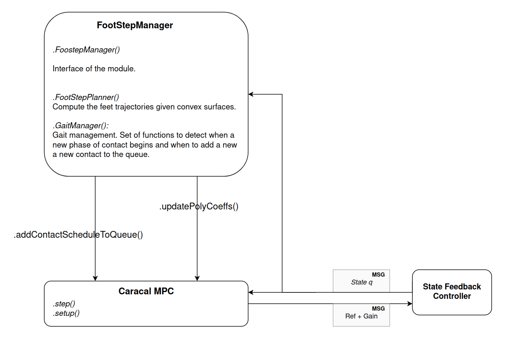

## Footstep planner
This module is used to interface with the caracal library. It allows to update the trajectory of the feet at each time step by sending to the Caracal MPC the new polynomial coefficients of the trajectory. It contains :
- FootstepManager : Wrapper class to interface with Caracal.
- GaitManager : Allow creation and delation of Contact Schedule. Get the informations of the current gait to send to the surface planner.
- FootstepPlanner : Given a queue of contact, update the swing trajectory using Raibert's heuristic.
- params : A parameters class configurable with a yaml file.

---
#### Dependencies
It should works with python2.
- numpy
- quadprog
- caracal
- pinocchio
- yaml
- hpp-fcl
