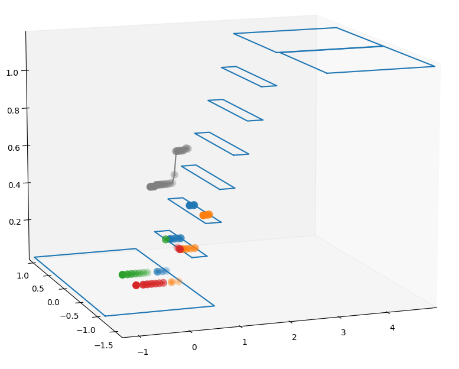
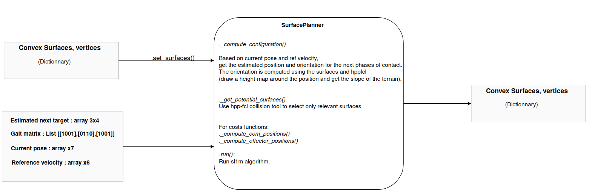

## Surface Planner

This module run SL1M algorithm to select the surfaces. Given a set of convex surfaces, position of the robot and desired velocity, it returns the surfaces for the next contact phases. For 3 phases of contact, it takes around 100/200ms.






---
### Examples:

Surfaces obtained using the walgen_surface_processing module has been stored in the data folder to run example.
Example with surfaces obtained from .stl file :
```
python3 -m walkgen_surface_planner.stand_alone_scenarios.anymal_stairs
```

Example with surfaces obtained from planeseg library :
```
python3 -m walkgen_surface_planner.stand_alone_scenarios.anymal_stairs_planeseg
```

---
### Dependencies:

- numpy, pickle, matplotlib, scipy
- trimsesh : ```pip3 install trimesh```
- sl1m : https://github.com/loco-3d/sl1m/tree/devel
- Gurobi : https://www.gurobi.com/documentation/9.5/quickstart_windows/software_installation_guid.html
- eigen, boost-python
- pinocchio (python): ```sudo apt install -qqy robotpkg-py38-pinocchio```
- eiquadprog (cpp): ```sudo apt install robotpkg-eiquadprogs```
- hpp-fcl (cpp+python): ```sudo apt install robotpkg-py38-hpp-fcl```
