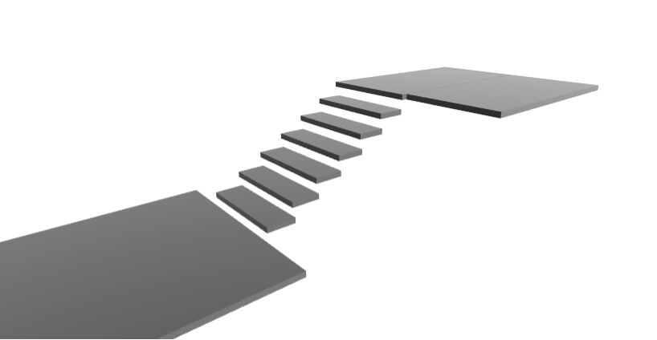
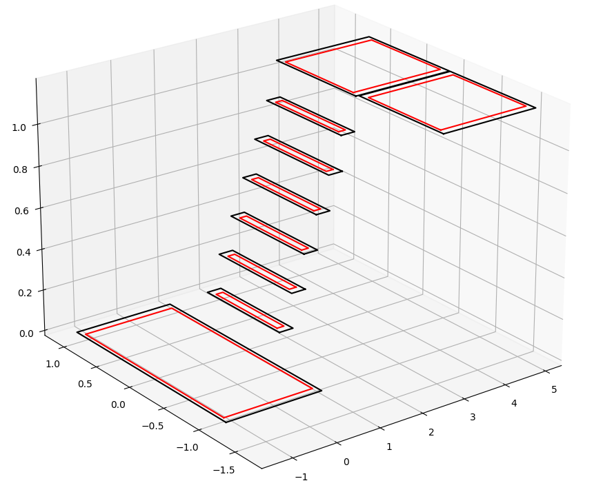
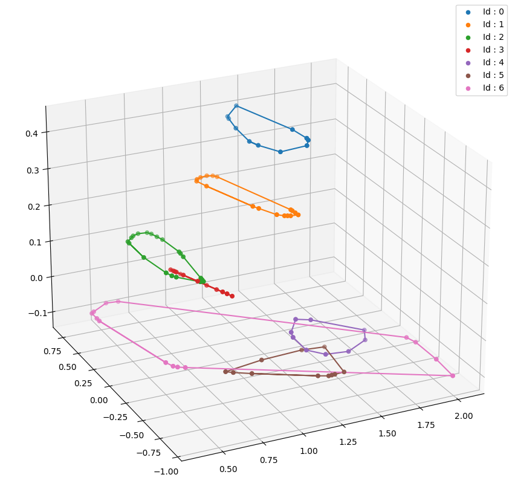
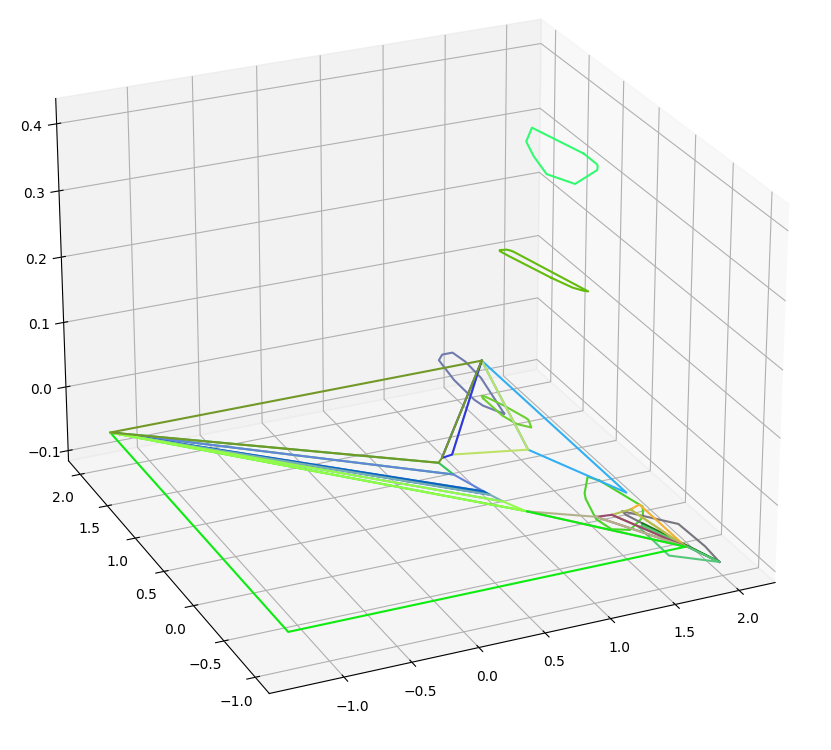

# Surface Processing

Tools to extract convex patch from .stl file or post-process a set of convex surfaces.


## Convex surfaces from .stl file :
### From a single .stl file
---

Extraction of support surfaces based on hpp-affordance library. A margin inside the surfaces can be added. To run an example :
```
python3 -m walkgen_surface_processing.examples.process_stl
```
Example of how to use the files :
- data/
    - meshes/
        - lab_scene.stl (single .stl file)
    - urdf/
        - lab_scene.urdf (urdf file pointing to .stl file, useful for pybullet)
        

Mesh file | Surfaces extracted
--- | ---
 | 


### From a multiple .stl file
---
Extract directly surfaces from a folder of .stl files ( 1 .stl file corresponding to a single surface). Useful when dealing with a large scene. Set params.extract_methodId to 1.

For a more complex scene, the automatic surface extraction may not work. The surfaces (planar objects with vertices) need to be extracted manually (using Blender for example) in distincts .stl files. Then, a custom class SurfaceLoader load the surfaces one by one by looking inside the folder given, and apply the surface margins processing on each surfaces. Since the amount of data is important, the environments files for such scene has been moved to :  
https://github.com/thomascbrs/walkgen-environment-data . 

To run an example, setup the path inside the examples files and :

```
python3 -m walkgen_surface_processing.examples.process_stl_folder
python3 -m walkgen_surface_processing.examples.process_icra_scene
```
Example of how to use the files on ICRA g3 environments:
- environments/
    - meshes/
        - ICRA_parkour_3.stl (single .stl file of the entire scene)
        - ICRA_parkour_separated_g3/ (contain separated files for surfaces)
            - surfaces_g0/
                - map_surfaces_074.stl (single surfaces, 4 vertex)
                - map_surfaces_088.stl
                - map_surfaces_127.stl
                - ...
            - surfaces_g3/
                - map_surfaces_093.stl
                - map_surfaces_097.stl
                - ...
            - surfaces_g4/
                - ...
            - surfaces_g5/
            - surfaces_inclinded/
            - surfaces_rounded/
    - urdf/
        - ICRA_parkour_3.urdf (urdf file pointing to the .stl file, useful for pybullet)


## Post-process of planeseg data:

"Plane Seg is a library for fitting planes to LIDAR, depth camera data or elevation maps. It uses robust estimation to fit planes by clustering planar points with similar normals" : https://github.com/ori-drs/plane_seg.

Some tools to post-process the data given by this library can be found here :
- Add an inner margin to the convex surfaces.
- Add a surface of support under the robot.
- Reduce the number of points of the surfaces.
- Remove overlapping between surfaces by using a convex decomposition (using Tess algorithm, see https://github.com/azrafe7/hxGeomAlgo)
- Remove surfaces with a small area.

For more information, see the notebook post-processing-tools.ipynb. To run an example :

```
python3 -m walkgen_surface_processing.examples.process_planeseg
```

Planeseg surfaces | Post-Processing
--- | ---
 | 

---
## Dependencies:

- numpy, pickle, matplotlib, scipy
- visvalingamwyatt algorithm : ```pip3 install visvalingamwyatt```
- rdp algorithm (only for comparison with visvalingamwyatt) : ```pip3 install rdp```
- shapely : ```pip3 install shapely```
- pinocchio (python): ```sudo apt install -qqy robotpkg-py38-pinocchio```
- eiquadprog (cpp): ```sudo apt install robotpkg-eiquadprogs```
- hpp-fcl (cpp): ```sudo apt install robotpkg-hpp-fcl```
- hpp-affordance (cpp): ```sudo apt install robotpkg-hpp-affordance```
